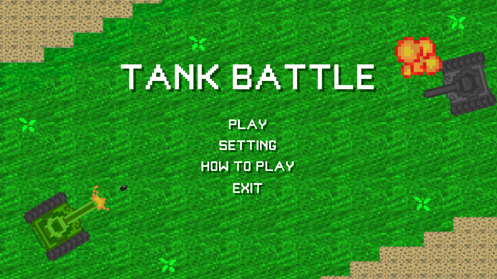

# Tank Battle Game  

## 🎮 Overview  
**Tank Battle** is a local multiplayer tank shooting game built with Unity. Players take control of their tanks in a 2D environment, maneuvering and firing to destroy their opponent.  

The game is simple yet competitive, making it fun for friends to play together on the same machine.  

---

## 🕹️ Gameplay  

### Player Controls:  
- **Player 1**:  
  - Move:  
    - `W`: Move Up  
    - `A`: Move Left  
    - `S`: Move Down  
    - `D`: Move Right  
  - Fire: `Space`  

- **Player 2**:  
  - Move:  
    - `Up Arrow`: Move Up  
    - `Left Arrow`: Move Left  
    - `Down Arrow`: Move Down  
    - `Right Arrow`: Move Right  
  - Fire: `Shift`  

### Objective:  
Destroy the opponent’s tank to win the round. Navigate the battlefield and shoot skillfully to outmaneuver your rival.  

---

## 📂 Features  
- **Local Multiplayer**: Battle a friend in 1v1 matches.  
- **Simple Gameplay**: Easy-to-learn controls and straightforward mechanics.  
- **Customizable Tanks**: Adjust tank properties like speed, health, and fire rate in the Unity Inspector.  

---

## 🛠️ Built With  
- **Game Engine**: Unity (2D Mode)  
- **Programming Language**: C#  

---

## 📥 Installation  

To run the game locally, follow these steps:  

1. Clone this repository to your local machine:  
   ```bash  
   https://github.com/toladev0/Tank-Battle-Project.git
2. Open the project in Unity.
- **Recommended** Unity Version: 2022.3 or newer.
3. Run the game in the Unity Editor or build it for your preferred platform (e.g., Windows, macOS).

---

## 🚀 How to Play
- Start the game and select a battle arena.
- Player 1 uses `WASD` + `Space` to move and fire.
- Player 2 uses the `Arrow Keys` + `Shift` to move and fire.
- Destroy the opponent’s tank to win!

---

## 📸 Screenshots

Here are some gameplay screenshots from **Tank Battle 2D**:  

<div align="center">  
  <table>  
    <tr>  
      <td></td>  
      <td></td>  
      <td></td>  
    </tr>  
    <tr>  
      <td></td>  
      <td></td>  
    </tr>  
  </table>  
</div>  

## 📖 Future Updates
Exciting features planned for future versions:
- Single-player mode: Play against AI-controlled tanks.
- Power-ups: Add power-ups such as health packs, shields, or speed boosts.
- New Maps: Introduce more battle arenas with unique layouts and challenges.
- Sound Effects: Add immersive audio for shooting, tank movement, and explosions.

---

## 📧 Contact
For feedback or suggestions, feel free to reach out:

- **GitHub**: TolaDev0
- **Email**: lonwtolagmail.com

Let me know if you need help with these final touches! 😊
